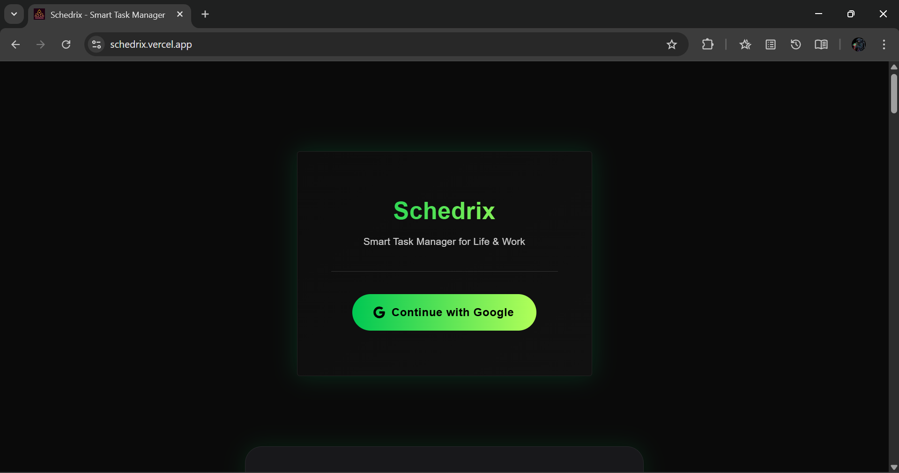
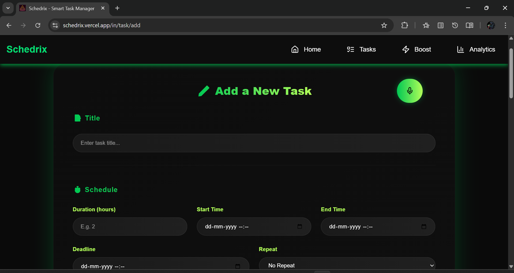
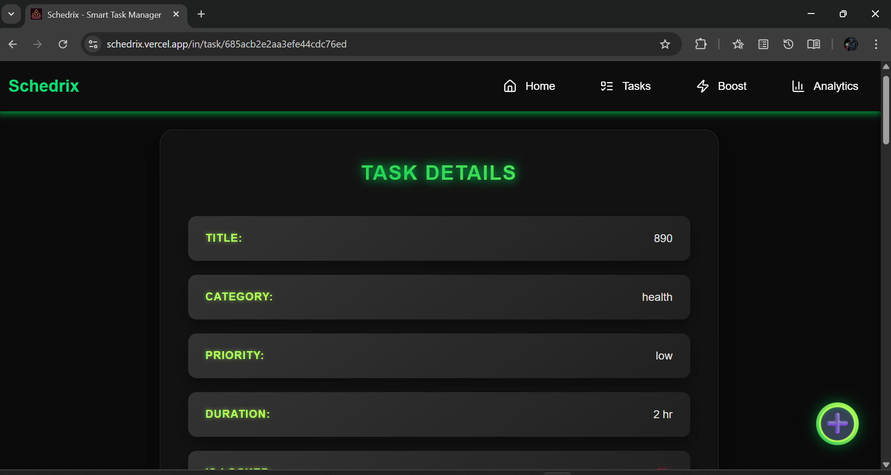
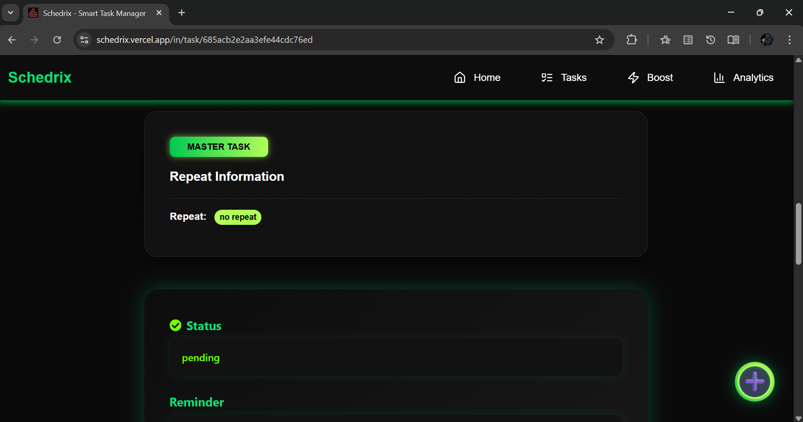
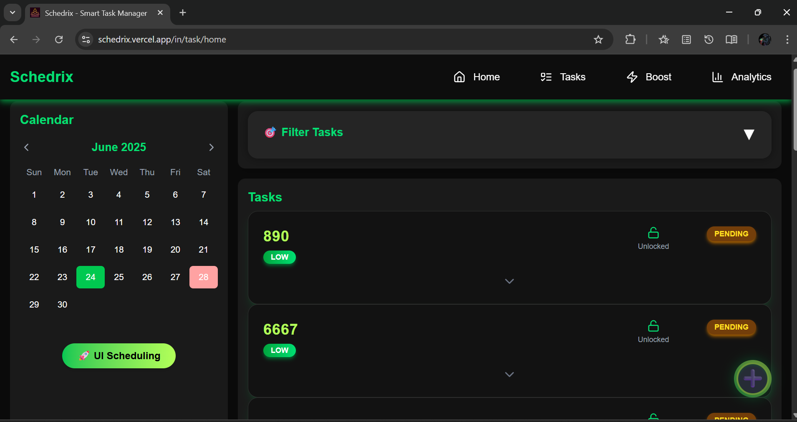
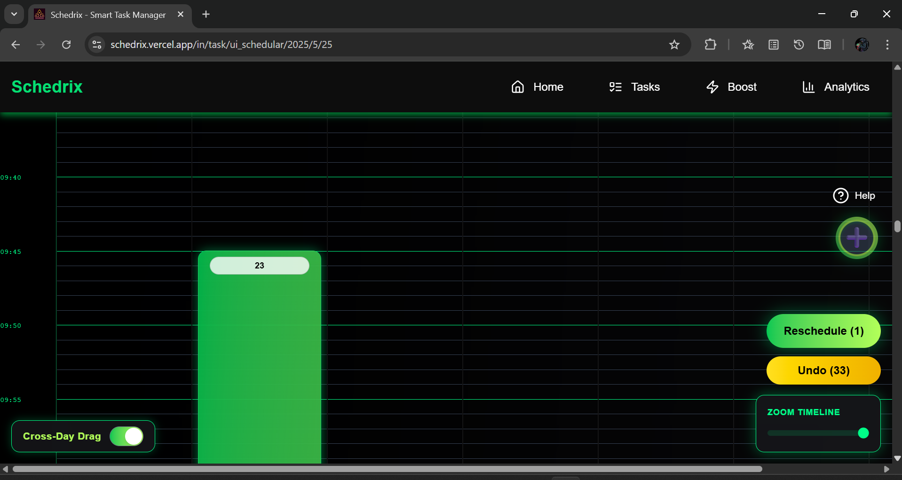
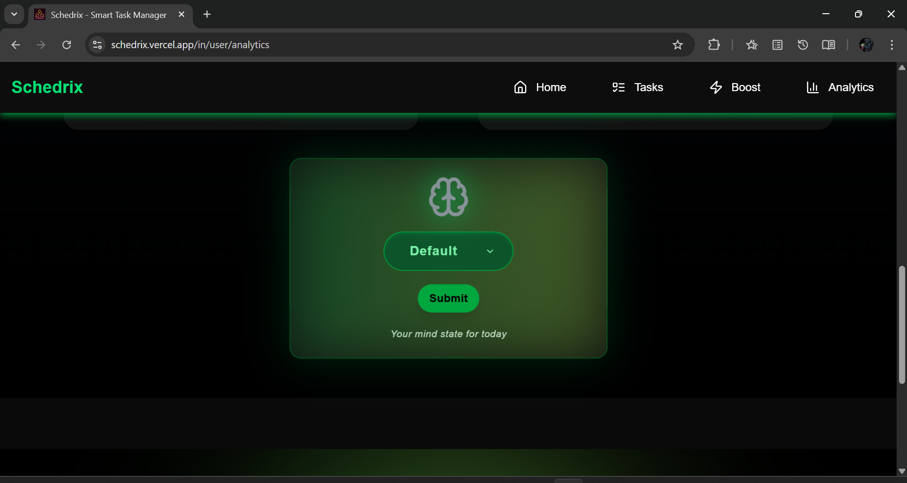
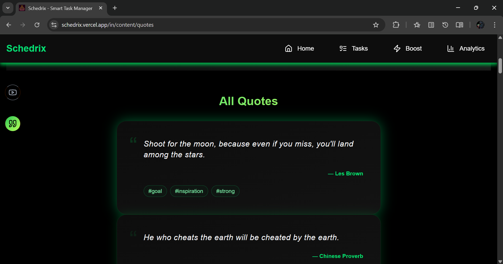
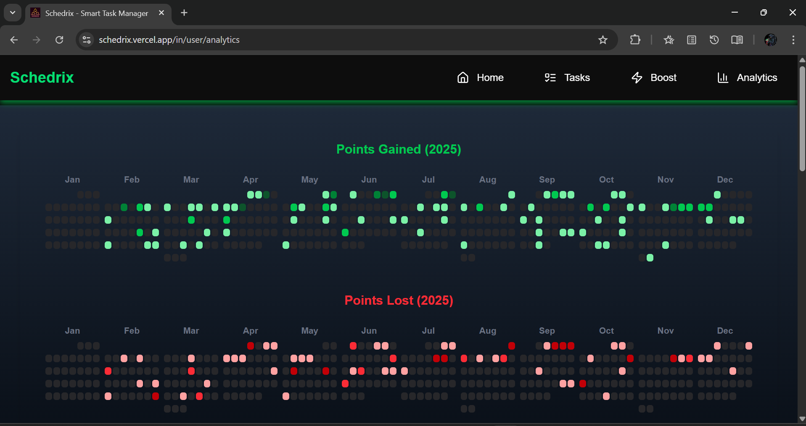
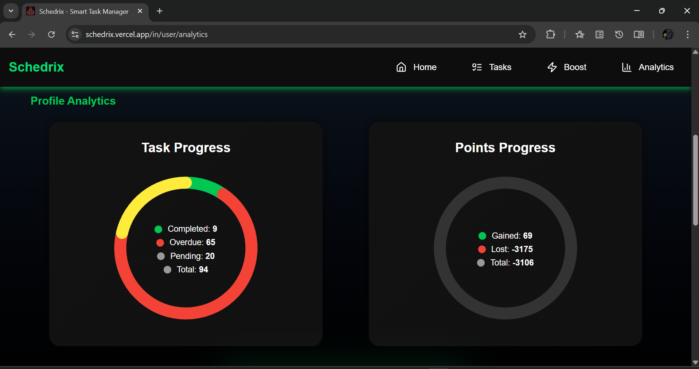

# 🌱 Schedrix — AI-Powered Task Management & Motivation Platform

**Schedrix** is a smart scheduling and motivation tool powered by AI. It blends productivity, emotional intelligence, and gamification into a seamless, interactive experience — helping users plan tasks, stay focused, and feel motivated based on their mood.

&#x20;

---

## 📚 Table of Contents

* [Live Demo](#-live-demo)
* [Features](#-features)
* [AI & ML Highlights](#-ai--ml-highlights)
* [Tech Stack](#-tech-stack)
* [Project Structure](#-project-structure)
* [Setup Instructions](#️-setup-instructions)
* [Core Modules](#-core-modules)
* [Visual Analytics](#-visual-analytics)
* [Upload System](#-upload-system)
* [Auth & Security](#-auth--security)
* [Caching Strategy](#-caching-strategy)
* [Learnings & Practices](#-learnings--practices)
* [Author](#-author)
* [License](#-license)

---

## 🎥 Preview Media

To fully appreciate what Schedrix offers, check out the visuals below.

| ✨ Feature                | 🎬 Preview                                                        |                                                                   |
| ------------------------ | ----------------------------------------------------------------- | ----------------------------------------------------------------- |
| Login Page               |                                 |                                                                   |
| Task Creation (Full)     |                      |                                                                   |
| Task Details View 1      |                      |                                                                   |
| Task Details View 2      |                      |                                                                   |
| All Task List View       |                                 |                                                                   |
| Timeline UI (drag, zoom) |                      |                                                                   |
| MoodStatus view          |                                 |                                                                   |
| All Quotes View          |                            |                                                                   |
| Point Contribution Grid  |                          |                                                                   |
| Task Status Distribution |             |                                                                   |
| 📽️ Full Demo            | [Watch on YouTube](https://www.youtube.com/watch?v=your-video-id) | [Watch on YouTube](https://www.youtube.com/watch?v=your-video-id) |

>

---

## 🚀 Live Demo

🔗 [Live App](https://schedrix-client.vercel.app)
🔗 [API Server](https://schedrix-server.onrender.com)
🔗 [ML Service](https://schedrix-ml.onrender.com)

---

## ✨ Features

* 📅 **Smart Timeline Scheduling** (drag-drop, zoom, undo)
* 🔔 **Task Reminders via FCM Notifications**
* 🎯 **Gamified Points System** (reward & penalty)
* 🧠 **Mood Tracking** with AI-based mindStatus prediction
* 💬 **Daily Motivation**: Quote + AI elaboration + AI image
* 🧠 **Quote Tagging via Zero-Shot Classifier**
* 📊 **Contribution Grid** to visualize task history & points
* 🖼️ **Image + Audio Upload** during task creation
* 🔃 **Google Calendar Integration** (coming soon)
* 🌈 **Stunning UI with Green Aura + Framer Motion**

---

## 🧠 AI & ML Highlights

* **MindStatus Prediction**
  LSTM model trained on user behavior from the last 7 days.

* **AI-Based Motivation**
  Quotes → Gemini elaboration → SDXL image → Mood tag classification.

* **MindState-Specific Content**
  Motivational videos from YouTube based on current mood.

---

## 🧱 Tech Stack

**Frontend**
Next.js (App Router), Tailwind CSS, Zustand, ShadCN UI, Framer Motion

**Backend**
Express.js, MongoDB, Passport.js, BullMQ, Redis, Multer, Cloudinary

**ML Service**
Flask + TensorFlow (LSTM), Dockerized with Gunicorn

---

## 🧡 Project Structure

```
client/         → Next.js frontend  
server/         → Express backend, ml-models & background workers
```

---

## ⚙️ Setup Instructions

### Prerequisites

* Node.js (v18+), Python 3.11+
* MongoDB + Redis running
* Vercel or Render account

### Server Environment Setup

```env
GOOGLE_CLIENT_SECRET=...
GOOGLE_CLIENT_ID=...
SESSION_SECRET="hello"
GOOGLE_CALLBACK_URL=...
MONGO_URI=...

REDIS_HOST=...
REDIS_PORT=...
REDIS_PASSWORD=...
HF_TOKEN=...
YOUTUBE_API_KEY=...
GEMINI_API_KEY=...
FIREBASE_SERVICE_ACCOUNT_BASE64=...

CLOUDINARY_CLOUD_NAME=...
CLOUDINARY_API_KEY=...
CLOUDINARY_API_SECRET=...
CLOUDINARY_API_ENVIRONMENT_VARIABLE=...
```

### Run Frontend

```bash
cd client
npm install
npm run dev
```

### Run Backend (main server)

```bash
cd server
npm install
npm run dev
```

### Run Backend (main server, ml service, workers - all together)

```bash
cd server
pip install -r requirements.txt
npm install
npm run start
```

### Run Workers only

```bash
cd server
npm install
node src/backgroundService.ts
```

---

## 📦 Core Modules

* 🎯 Task creation, deadlines, duration, audio/image support
* 🔒 Fixed & locked task types
* 🧠 Mood prompts every 3 days
* 📋 Points deducted via daily 3AM cron
* 🔀 Smart image caching for QOTD
* 🔔 Push notifications using FCM
* 🗒️ BullMQ-based job scheduling

---

## 📊 Visual Analytics

* GitHub-style calendar grid
* Green = points gained, Red = points lost
* Tooltips show detailed info

---

## 📸 Upload System

* Task images saved via Multer → uploads/tasks/
* Audio recorded → uploads/audio/
* QOTD image saved in Cloudinary with cache check

---

## 🔐 Auth & Security

* Google OAuth with Passport.js
* Session-based login with secure cookie setup:

```ts
cookie: {
  httpOnly: true,
  secure: true,
  sameSite: 'none',
}
```

---

## 🧠 Caching Strategy

| Layer      | Usage                    | Tool    |
| ---------- | ------------------------ | ------- |
| Express.js | session lookups          | Redis   |
| Next.js    | analytics revalidation   | fetch() |
| Frontend   | user state + preferences | Zustand |
| MongoDB    | leaderboard / summaries  | Redis   |

---

## 🧪 Learnings & Practices

* Session sync across Express ↔️ Next.js via secure cookies
* LSTM-based predictions integrated via Python `child_process`
* Semantic AI tagging via BART with fallback NLP keyword match
* Dockerization to resolve TensorFlow environment issues

---

## 🙌 Author

Crafted by **Soura Man**

🔗 Powered by:

* [Hugging Face Inference API (Stable Diffusion XL)](https://huggingface.co/stabilityai/stable-diffusion-xl-base-1.0)

* [facebook/bart-large-mnli - Zero Shot Classification](https://huggingface.co/facebook/bart-large-mnli)

* [ZenQuotes API](https://zenquotes.io/)

* [Gemini API](https://gemini.google.com)

* [YouTube Data API](https://developers.google.com/youtube)

---

## 📜 License

MIT License © 2025 souraman19

---

> *“Don’t just manage your time. Master your mindset.” — Welcome to Schedrix.*
